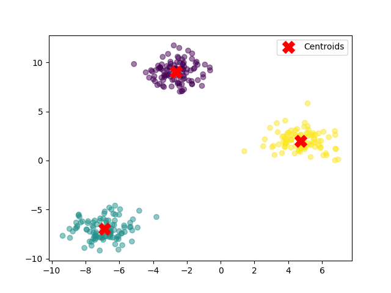

# Custom K-Means Clustering

This repository contains an implementation of the K-Means clustering algorithm from scratch, designed to work similarly to `sklearn.cluster.KMeans`. However, it uses a **custom distance metric** based on the dimensionality of the input data:

- **1D Data** → Uses **Manhattan Distance** (L1 norm)
- **2D Data** → Uses **Euclidean Distance** (L2 norm)
- **3D and above** → Uses **Minkowski Distance** with p = 3


## Example Output
when `k=3`


## Features
✅ Fully implemented from scratch
✅ Supports multiple distance metrics based on input dimensionality
✅ Works like Scikit-learn’s KMeans


## Installation
You can install this package by cloning the repository and using `pip`:
```sh
pip install .
```
Or you can install it from pypi
```
pip install simple-kmeans
```


## Usage
Here’s an example of how to use the custom K-Means implementation:

```python
from simple_kmeans import KMeans
import numpy as np
import matplotlib.pyplot as plt

# Generate sample data
X = np.array([[1, 2], [1.5, 1.8], [5, 8], [8, 8], [1, 0.6], [9, 11]])

# Initialize and fit the model
kmeans = KMeansCustom(k=2, max_iters=100)
kmeans.fit(X)

# Get cluster centers and labels
print("Cluster Centers:", kmeans.centroids)
print("Labels:", kmeans.labels)

# Plot results
plt.scatter(X[:, 0], X[:, 1], c=kmeans.labels, cmap='viridis')
plt.scatter(kmeans.centroids[:, 0], kmeans.centroids[:, 1], marker='x', c='red', s=200, label='Centroids')
plt.legend()
plt.title("Custom K-Means Clustering")
plt.show()
```


## License
This project is open-source and available under the **MIT License**.


## Contributions
Contributions, issues, and feature requests are welcome! Feel free to fork this repository and submit a pull request.


